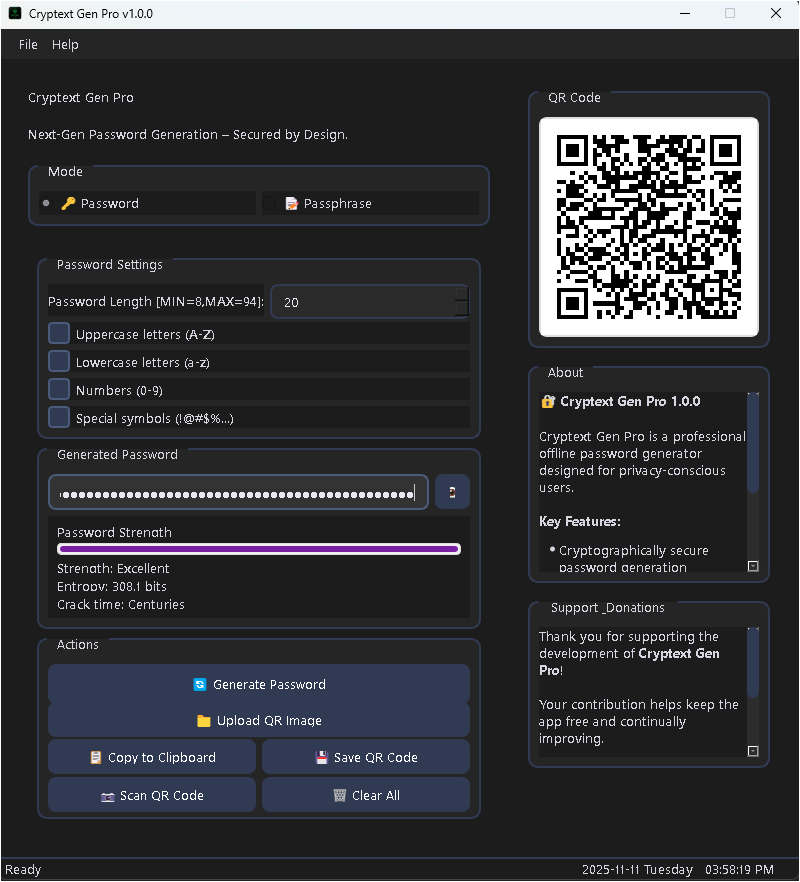
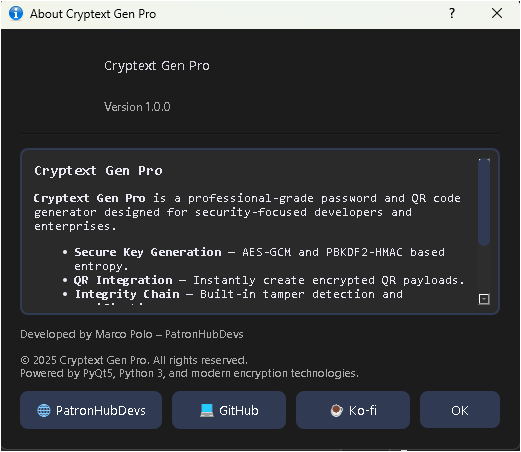
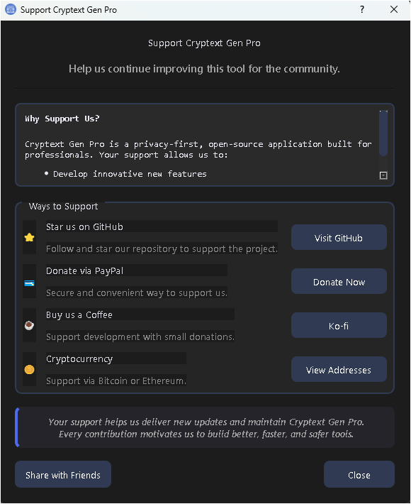
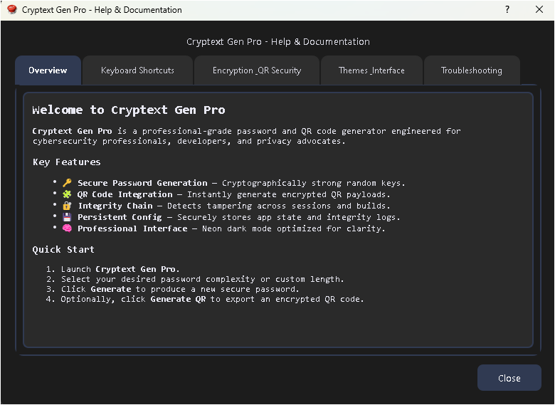

# Cryptext Gen Pro v1.0.0


**Cryptext Gen Pro** is a professional-grade password and passphrase generator with QR code support, designed to help users generate, manage, and securely store credentials with ease. Built with Python and PyQt5, it offers modular architecture, robust encryption, and a modern interface for both personal and enterprise use.

---

## 📂 Project Structure

```
PROJECT_STRUCTURE:
cryptex_gen_pro/
│
├── main.py                          # Application entry point
│
├── app_config/
│   ├── __init__.py
│   ├── config.py                    # Configuration & constants
│   └── resources_rc.py              # Qt resource file (generated)
│
├── core/
│   ├── __init__.py
│   ├── password_generator.py        # Password generation logic
│   ├── passphrase_generator.py      # Passphrase generation logic
│   ├── qr_handler.py                # QR code generation & scanning
│   ├── strength_analyzer.py         # Password strength calculation
│   └── wordlist_loader.py           # Wordlist management
│
├── ui/
│   ├── __init__.py
│   ├── main_window.py               # Main window setup
│   ├── styles.py                    # UI styling & theming
│   └── widgets/
│       ├── __init__.py
│       ├── password_tab.py          # Password tab UI
│       ├── passphrase_tab.py        # Passphrase tab UI
│       ├── control_panel.py         # Left control panel
│       └── info_panel.py            # Right info panel
│
├── dialogs/
│   ├── __init__.py
│   ├── about_dialog.py
│   ├── help_dialog.py
│   ├── donate_dialog.py
│   └── camera_select_dialog.py
│
├── utils/
│   ├── __init__.py
│   ├── clipboard_manager.py         # Clipboard operations
│   ├── file_handler.py              # File I/O operations
│   ├── encryption.py                # Encryption utilities (Maya QR)
│   └── logger.py                    # Logging setup
│
└── assets/
    ├── logo.png
    ├── icon.ico
    ├── stylesheet.qss
    ├── maya_qr.bin
    └── wordlist/
        └── eff_file.wordlist
```

---

## ⚡ Features

### 🧠 Password & Passphrase Management

* Generate **secure passwords** (customizable length, symbols, numbers, upper/lowercase).
* Generate **passphrases** from EFF wordlists with configurable number of words and separators.
* Copy credentials to clipboard safely.
* Toggle visibility for sensitive fields.

### 🎨 User Interface

* Clean and modern **PyQt5 GUI** with modular tabs.
* **QR code integration**: generate, save, scan, and upload passwords/passphrases.
* Supports multiple **themes** (dark/light/default) with fallback handling.
* Status bar shows current activity and QR generation feedback.

### 🔒 Security

* **AES-256-GCM encryption** for sensitive clipboard operations.
* HMAC verification for QR integrity.
* Wordlist fallback ensures passphrase generation reliability.

### 🧩 Architecture

* Modular structure for easy maintenance, updates, and future extensions.
* Compatible with Windows, Linux, and macOS.
* Supports **PyInstaller builds** for standalone executables.

---

## 🖼 Screenshots

**Main Window (Password Tab):**



**Passphrase Tab & QR Code:**


**About Dialogs:**



**Donate Dialogs:**


**Help Dialogs:**


---

## 🚀 Installation

1. Clone the repository:

```bash
git clone https://github.com/j3fcruz/Cryptext-Gen-Pro.git
cd Cryptext-Gen-Pro
```

2. Create a virtual environment (recommended):

```bash
python -m venv venv
source venv/bin/activate  # Linux/Mac
venv\Scripts\activate     # Windows
```

3. Install dependencies:

```bash
pip install -r requirements.txt
```

4. Run the application:

```bash
python main.py
```

> **Note:** The passphrase generator requires the `eff_file.wordlist`. Ensure it exists in `assets/wordlist/eff_file.wordlist`.

---

## 🏗 Build & Packaging

To generate a standalone executable using **PyInstaller**:

```bash
pyinstaller --onedir --noconsole --clean --uac-admin \
    --icon="assets/icons/icon.ico" \
    --name="Cryptext_Gen_Pro" \
    --add-data "ui;ui" \
    --add-data "assets;assets" \
    --add-data "app_config;app_config" \
    --exclude-module PySide6 \
    main.py
```

* **--onedir:** Creates folder with executable + dependencies
* **--noconsole:** Hides console window (GUI only)
* **--uac-admin:** Requests admin privileges on Windows
* **--add-data:** Includes assets, UI modules, and config
* **--exclude-module:** Excludes unnecessary Qt bindings (PySide6)

After building, executable will be in:

```bash
dist/Cryptext_Gen_Pro/
```

---

## 📝 Usage

1. **Select Mode:** Password 🔑 or Passphrase 📝
2. **Generate:** Click “Generate” button
3. **Copy:** Copy credentials to clipboard
4. **QR Code:** Generate, save, scan, or upload
5. **Clear:** Reset fields
6. **Settings:** Adjust password length, symbols, word count, or separator

---

## ⚙ Dependencies

```text
PyQt5>=5.15.7
cryptography>=41.0.0
qrcode[pil]>=8.2 
pillow>=8.0 
pyinstaller 
opencv-python
pyzbar>=0.1.9
```

Install via pip:

```bash
pip install -r requirements.txt
```

---

## 🛠 Contributing

1. Fork the repository
2. Create a new branch: `git checkout -b feature/YourFeature`
3. Commit your changes: `git commit -m "Add YourFeature"`
4. Push branch: `git push origin feature/YourFeature`
5. Open a Pull Request

> All contributions must follow the modular structure and include proper documentation.

---

## 📜 License

This project is licensed under the MIT License. See the [LICENSE](LICENSE) file for details.

---

## 👤 Author

**Marco Polo (PatronHub)**

* GitHub: [@j3fcruz](https://github.com/j3fcruz)
* Ko-fi: [@marcopolo55681](https://ko-fi.com/marcopolo55681)
* Website: [PatronHub Devs](https://patronhubdevs.online)

---

## 🔑 Notes

* Always backup generated passwords and passphrases.
* Application supports UTF-8 text.
* Recommended for password management, secure credential generation, and personal documentation.

---

## 🧩 Version History

### [1.0.0] – 2025-11-11

#### Initial Release

* Professional password and passphrase generator with QR support
* Modern PyQt5 GUI with dark default themes
* Clipboard integration and QR code management
* Modular architecture for easy maintenance and expansion
